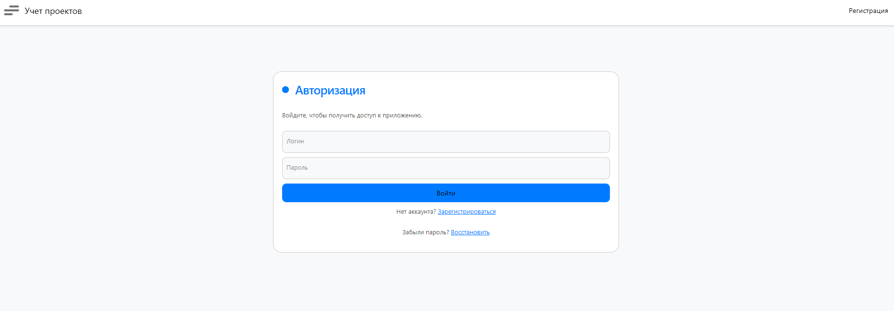
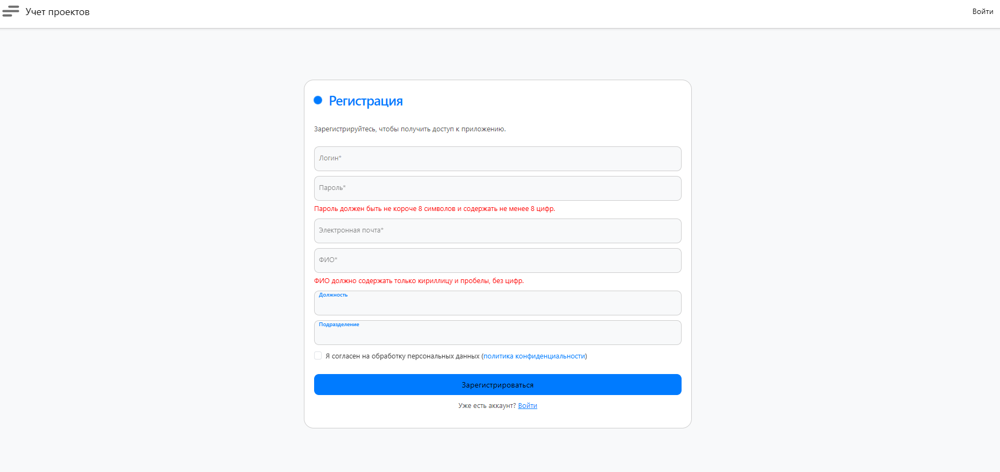
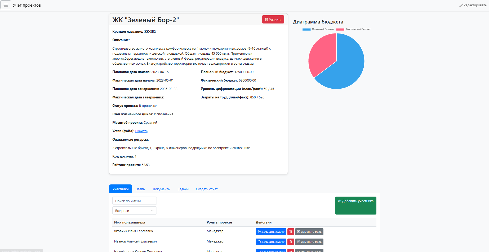
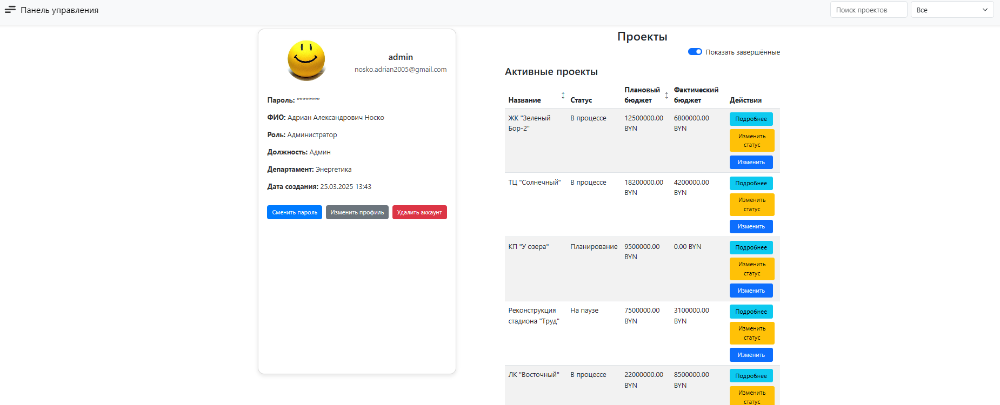
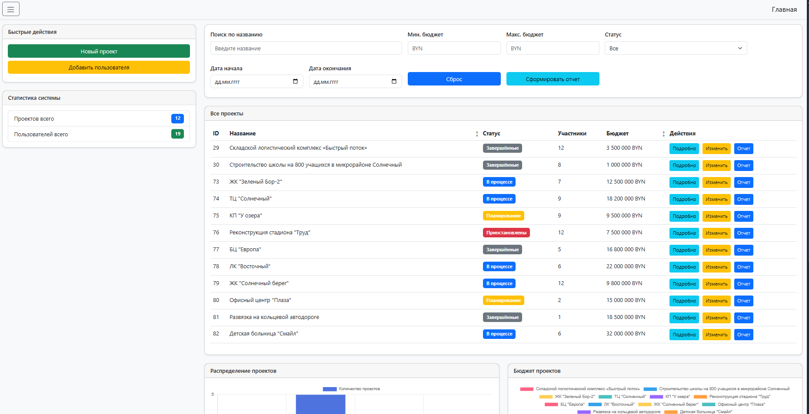

<div align="center">
  
  
  <h1>🚧 Система управления строительными проектами</h1>
  <h3>Веб-приложение для ОАО «МАПИД» | Дипломный проект</h3>
  
  <p>
    
    
  </p>
  
  <p>
    
    
    
    
    
  </p>
</div>

---


## 📝 Оглавление
- [📌 О проекте](#-о-проекте)
- [🚀 Быстрый старт](#-быстрый-старт)
- [🛠️ Функционал](#️-функционал)
- [🖥️ Скриншоты](#️-скриншоты)

---

## 📌 О проекте

Веб-приложение для автоматизации управления строительными проектами в ОАО «МАПИД», разработанное в рамках дипломного проекта Колледжа бизнеса и права.

**Основные цели:**
- ✅ Автоматизация управления проектами
- ✅ Оптимизация документооборота
- ✅ Улучшение взаимодействия между отделами
- ✅ Генерация аналитических отчетов

### 👥 Роли пользователей
| Роль | Иконка | Доступ |
|------|--------|--------|
| **Администратор** | 👨‍💼 | Полный доступ к системе |
| **Менеджер проекта** | 👷 | Управление проектами |
| **Сотрудник** | 🛠️ | Работа с задачами |
| **Клиент** | 👤 | Просмотр информации |

---

## 🚀 Быстрый старт

### 📋 Системные требования
| Компонент | Версия |
|-----------|--------|
| PHP | 8.0+ |
| MySQL | 5.7+ |
| Apache/Nginx | 2.4+ |
| Composer | 2.0+ |

### ⚙️ Установка
```bash
# 1. Клонирование репозитория
git clone https://github.com/Dizainer05/construction-management-system.git
cd construction-management-system

# 2. Установка зависимостей
composer install
npm install

# 3. Настройка окружения
cp .env.example .env
php artisan key:generate

# 4. Импорт базы данных
mysql -u [user] -p [database] < database/dump.sql

# 5. Запуск сервера
php artisan serve

```
## 🛠️ Функционал

<div align="center">

| Модуль           | Возможности                                                                 |
|------------------|-----------------------------------------------------------------------------|
| **Проекты**      | Создание, календарное планирование, контроль сроков, назначение ответственных |
| **Документы**    | Загрузка чертежей, версионность, поиск, экспорт в Excel/Word      |                 |
| **Отчетность**   | Автогенерация отчетов (PDF/Excel)         |


</div>


### Скриншоты интерфейса (`## 🖥️ Скриншоты интерфейса`)

<div align="center">
  <h3>Старница Авторизации</h3>
  
  <h3>Старница Регистрации</h3>
  
  <h3>Главаня страница</h3>
  
  <h3>Старница Проектов</h3>
  
  <h3>Старница Профиля</h3>
  
  <h3>Старница Админ-панель</h3>
  

</div>
